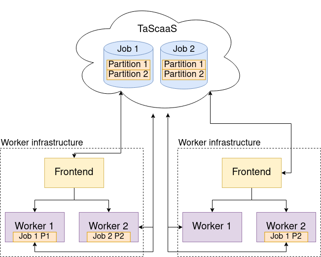
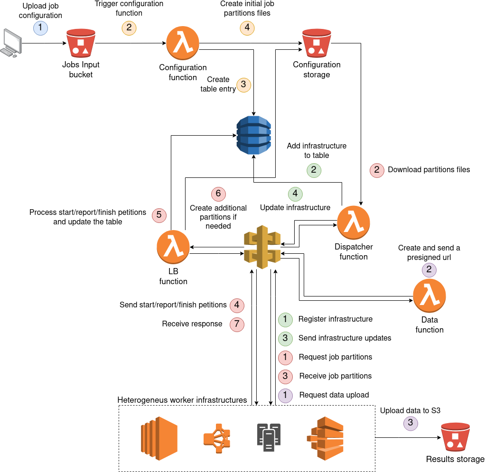

# TaScaaS
 
 Task Scheduler As A Service (TaScaaS) provides a complete serverless service to schedule and distribute High Throughput Computing (HTC) jobs among your computational infrastructures. 
 
 

TaScaaS create and handles jobs to be executed among all the available worker infrastructures, which are constituted by several workers capable to execute our jobs. For example, a worker infrastructure could be a cluster handled by Slurm, a scalable infrastructure deployed on EC2, etc. The jobs are created by TaScaaS according to the configuration files uploaded by the user to S3, as we will explain in the following sections. Then, each job is split in partitions that can run independently. Finally, these partitions will be distributed among the available workers in the worker infrastructures. To distribute the partitions, the frontend request to the TaScaaS infrastructure as many job partitions as their workers can process concurrently. Then, it assign each partition to the local workers. On the other hand, the workers communicate with the TaScaaS infrastructure to report their progress on the job partition computation.

Also, TaSCaaS assists your worker infrastructures to scale according to the workload and provides an integrated load balance system for the jobs. The scale process of the worker infrastructures is supposed to be done updating the number of available workers. On the other hand, to balance the jobs, by default, TaScaas uses [RUPER-LB](https://github.com/PenRed/RUPER-LB). The balance procedure consists on distribute the total workload of each job among all the job partitions running on different workers, according to the worker performance capabilities. Although the balance system could be changed by another one with the same API, which is explained in section **Load balance API**, we encourage to use RUPER-LB as the load balance system, since the package includes a complete client which can be easily integrated in the user application. Furthermore, this client handles the possible errors returned by the server. Thus, the load balancer can be used transparently.
 
 
# Installation
 
 TaScaaS infrastructure can be easily deployed on AWS as a [Serverless Framework](https://www.serverless.com/) application without administrator privileges. Among all the available configuration parameters, only two parameters are mandatory to deploy the infrastructure:
 
 * **lambda_role**: Specify the [IAM role](https://docs.aws.amazon.com/IAM/latest/UserGuide/id_roles.html)'s ARN to be associated to the [AWS Lambda](https://aws.amazon.com/lambda) functions.
 * **secret**: Specify a secret string to allow the computing infrastructures to be registered in TaScaaS.

 The optional configuration parameters are listed below:
 
 * **stage**: The stage of the deployed infrastructure, such as *beta*, *test*, *prod*. Combined with **app_acronym**, is used to construct the name of the TaScaaS elements, such as [Amazon S3](https://aws.amazon.com/s3) buckets or [Amazon DynamoDB](https://aws.amazon.com/dynamodb/) tables. The default value is *test*.
 * **app_acronym**: A name for your application. Combined with **stage**, it is used to assign a name to TaScaaS elements. The default value is *htc-SLA*.
 * **region**: The [AWS region](https://aws.amazon.com/about-aws/global-infrastructure/regions_az/?nc1=h_ls) where the TaScaaS infrastructure will be deployed. The default value is *us-east-1*.
 * **init_workers**: Default initial workers for each submitted job. One worker is set as default.
 * **max_workers**: Maximum number of workers to be used for each submitted job. By default this value is set to 10.
 * **dynamo_read**: Number of [Read Capacity Units (RCUs)](https://docs.aws.amazon.com/amazondynamodb/latest/developerguide/ProvisionedThroughput.html#ProvisionedThroughput.CapacityUnits.Read) assigned to the DynamoDB table. The default value is 1.
 * **dynamo_write**: Number of [Write Capacity Units (WCUs)](https://docs.aws.amazon.com/amazondynamodb/latest/developerguide/ProvisionedThroughput.html#ProvisionedThroughput.CapacityUnits.Write) assigned to the DynamoDB table. The default value is 1.
 * **scaletime**: Duration, in seconds, of the scale steps, which will be explained in section **Scale hint**. The default value is 300.
 * **timeout**: Amount of time the job remains in the database. After this time, the job is removed, even if it has not completed. The value is specified in seconds and, by default, is set to one day (86400 seconds).
 
 An example to deploy the infrastructure with the default parameters:
 
 ```bash
 sls deploy --secret 1234 --name myScheduler --lambda_role arn:aws:iam::${IAMID}:role/${LAMBDAROLE}
 ```

# Scale hint
 
 As mentioned, the objective of TaScaaS is to coordinate different worker infrastructures, which in turn can be constituted by several working nodes. To determine the capacity of each worker infrastructure, TaScaaS stores two parameters:
 
 - The number of active slots (**slots**), that is, the number of simultaneous jobs that can be executed in the infrastructure, regardless the number of threads or processes used by each one.  
 - The maximum number of slots (**maxSlots**), that is, how many slots can be allocated by the infrastructure to execute jobs. For example, in a single node with 8 cores, we can reserve initially 4 cores to perform jobs (slots=4) but, if the workload increases, we can reserve until 8 cores to perform jobs (maxSlots=8).
 
 With this information, and the number of dispatched and queued jobs, TaScaaS calculates the percentage of the total maximum slots required to handle the incoming workload. This percentage is sent to the worker infrastructures to hint them to allocate or remove working nodes. To avoid continuous changes due to fluctuations on the number of incoming jobs or their execution times, this process is divided in two steps:
  1. The first one, consists on getting data. During this period, TaScaaS stores information about the dispatched jobs. Once the getting data time finished, this information is combined with the number of queued jobs and the number of active slots to determine how many active slots are required to tackle the incoming workload. Then, the number of required slots is converted as a percentage of the total allocatable slots by all infrastructures i.e. the sum of all **maxSlots**. Finally, this percentage is sent to the worker infrastructures during the update and jobs requests, as we will explain at the API section. 
 
 1. Once the number of required slots has been calculated, begins the second step, the scaling process. In this, TaScaaS assumes that the worker infrastructures are scaling to allocate the required active slots. For example, deploying new computing nodes. As consequence, no new data is stored and the old one is removed.
 
 This two steps are repeated to adapt the number of active slots to the incoming workload. Notice that TaScaaS does not use any knowledge about the duration of the jobs executions, as they could depend strongly on the input data or other specific configuration parameters.
 
# API
 
 This section describes the API used to comunicate with the [Amazon API Gateway](https://aws.amazon.com/api-gateway). However, an OpenAPI v3 description file is provided in the file *api/api-gateway.yaml*.
 
 To allow external workers to communicate with TaScaaS, an [Amazon API Gateway](https://aws.amazon.com/api-gateway) is created with the following set of endpoints:
 
 * GET - https<nolink>://*API_ID*.execute-api.*REGION*.amazonaws.com/*STAGE*/results/upload/{jobID}/{worker}
 * GET - https<nolink>://*API_ID*.execute-api.*REGION*.amazonaws.com/*STAGE*/lb/{id}/report
 * GET - https<nolink>://*API_ID*.execute-api.*REGION*.amazonaws.com/*STAGE*/lb/{id}/finish
 * GET - https<nolink>://*API_ID*.execute-api.*REGION*.amazonaws.com/*STAGE*/lb/{id}/start
 * GET - https<nolink>://*API_ID*.execute-api.*REGION*.amazonaws.com/*STAGE*/node/register
 * GET - https<nolink>://*API_ID*.execute-api.*REGION*.amazonaws.com/*STAGE*/node/{id}/disconnect
 * GET - https<nolink>://*API_ID*.execute-api.*REGION*.amazonaws.com/*STAGE*/node/{id}/jobs
 * GET - https<nolink>://*API_ID*.execute-api.*REGION*.amazonaws.com/*STAGE*/node/{id}/update

 These will be explained in the following sections. All the endpoints will send a JSON response with a status code 200 if the request is handled correctly. If the request fails, a different status code and the corresponding error message will be sent as *statusCode* and *body* fields in the JSON response. 
 
 Notice that the TaScaaS package includes a Python script (*worker/worker.py*) that can be used to communicate with this API and simplify the integration with the user application. See the *Examples* section to learn how to use it.
 
## /node/register
 
 This endpoint handles the infrastructure registration. For that purpose, it requires three query string parameters,
 
 * **secret**: It must match the *secret* specified during the infrastructure deployment.
 * **slots**: Specify the number of current available slots to allocate jobs in the infrastructure that request the registration.
 * **maxSlots**: Specify the maximum slots that the registered infrastructure can reach.
 
 As response, the body contains a JSON with the following information,
 
 * **id**: A unique identifier string for the registered infrastructure.
 * **scaleTime**: The scale steps duration in seconds.
 
## /node/{id}/update
 
 This request updates the information of the worker infrastructure specified by the UUID (path parameter **id**). The functionality of this request is twofold. First, because the TasCaaS infrastructure registers the timestamp of the last update request done by each worker infrastructure. With this information, TasCaas considers as disconnected any worker infrastructure whose elapsed time, since the latest update, is greater than a threshold. Hence, during the scale step will be ignored. Moreover, if the elapsed time reaches a second threshold, the worker infrastructure will be removed from the database. Notice that is required an *update* API request, other requests does not update the timestamp.
 
 On the other hand, if the request contains query string parameters, it can be used to update the infrastructure working information. If the parameter **slots** is specified, the number of active slots is updated accordingly. This should be used when the requested capacity changes and the worker infrastructure scales to fit it. Also, it is possible to specify a **maxSlots** parameter to modify the number of maximum slots of the worker infrastructure.
 
## /node/{id}/disconnect
 
 Specifying the worker infrastructure UUID (path parameter **id**), removes it from the TaScaaS database. As a consequence, this identifier is cancelled and can't be used to request more jobs or updates. Also, the corresponding slots are not considered for future scaling steps.
 
## /node/{id}/jobs
 
 This endpoint requires an infrastructure UUID, provided by the */node/register* endpoint, and handles the jobs requests. In addition, the parameter **slots** must be provided as a query string parameter. This one indicates how many jobs the worker infrastructure can execute at this moment.
 
 As response, this endpoint returns a JSON with two fields, **requiredCap** and **configs**. The first one, specify the calculated required capacity to handle the incoming job workload. This is specified as percentage. For example, if a worker infrastructure has been registered with 1 initial active **slot** and 4 **maxSlots**, and TaScaaS requires a capacity of 50%, the infrastructure should scale to 2 active slots. On the other hand, the parameter **configs** is an array with the configurations of the dispatched jobs. The structure of each individual configuration is as follows,
 
 * **ID**: Job identifier uuid.
 * **reportTime**: Expected report time, calculated according to the expected total execution time. If the report time is negative, no report is required for this job. This reports are used to balance the workload among all workers executing the same job. Also, could be used to deploy more workers if the expected execution time can't be achieved by the current workers.
 * **worker**: Worker number among all workers executing the same job.
 * **data-url**: Presigned url to download the required data to perform the execution.
 * **nIter**: Number of *iterations* to perform. On non-balanced jobs, this parameter could correspond not only to iterations. For example, it could specify the number of files to process on an image recognition application.
 
 Notice that the **configs** array could be empty if there are not any scheduled jobs.
 
## /lb/{id}/start
 
 The start request requires the job identifier (**id**) as path parameter. Also, it is necessary to specify the worker number inside this job, and the elapsed time since the start of the execution via the query string parameters **worker** and **dt** respectively.

 As response, the **body** field contains a plain text with the following format:
 
 ```
 0
 Assigned: *Number*
 ETA: *Number*
 ```
 
 where the first number is the balance error code, **Assigned** is the new iterations assigned to the reporter worker and **ETA** the number of estimated remaining seconds to finish the whole execution. If the error code is not 0, it indicates that some error has been produced. The error handling depends on the used balance system. In  case of using RUPER-LB, both the errors and the message parsing are automatically handled by the provided client.
 
 
## /lb/{id}/report
 
 As explained previously, reports are used to reassign the number of iterations among all workers executing the same job, or to require more workers to finish the job in the specified time. 
 
 To perform a report, the job identifier (**id**) is required as path parameter. In addition, the job worker's number, the number of completed iterations and the elapsed time since the worker execution start must be specified via the query string parameters **worker**, **nIter** and **dt** respectively. The response is analogous to the */lb/{id}/start* case.
 
 If the balance system is enabled for a job, and a worker doesn't perform the reports, this worker will be considered as disconnected and its iterations reassigned to the other active workers.
 
## /lb/{id}/finish
 
 The finish request informs TaScaaS that this worker has finished its execution of the job specified with the path parameter **id**. In addition, the *finish* request require the same query string parameters as the *report* request. Notice that a worker could finish its execution before computing the number of assigned iterations due to external factors. If this happens, and the load balance is enabled for this job, the remaining iterations will be reassigned to the active workers.
 
## /results/upload/{jobID}/{worker}
 
 This request enables a worker to upload its results to the TaScaaS S3 bucket with the following key:
 
 ```
 /output/results/{jobID}/worker_{worker}
 ```
 
The paths parameters specify the job identifier (**jobID**) and the worker number inside this job (**worker**). Also, the worker infrastructure uuid must be specified in the query string parameters using the name **wID**.
 
 As response to the petition, a presigned url with permissions to put objects to the previous key will be sent. Then, with a simple https petition, the data can be uploaded to S3. For example, to upload the file *data.tar* with curl, the user can use a command like
 
 ```bash
 curl -X PUT -T "data.tar" "${presignedUrl}"
 ```
 
 where *presignedUrl* is the received url.
 
# Architecture 

 The TasCaaS infrastructure is summarised in the following diagram:
 
 
 
 There, the blue and orange steps represent the job submission mechanism, green and red colored steps describe the worker infrastructure and job execution life cycle, respectively, and, finally, purple steps correspond to the data upload mechanism.
 
 As shown, the infrastructure is constituted by a DynamoDB table and four Lambda functions, three of them accessible via an API Gateway. In addition, S3 is used as storage system for job configurations, input data and execution results. Notice that the execution is performed in the worker infrastructures, which are not deployed nor directly managed by TaScaaS. This means that TaScaaS is application independent, as it has no information about what application is running in the working nodes. However, due the lack of communication between infrastructures, it is intended to run HTC jobs. 
 
In the next subsections, a brief description of the purpose of the different components is provided. However, details such as the communication API are not included, since they have already been discussed in section **API**.

## Configuration
 The first Lambda function, the *configuration function*, is triggered when a file with the suffix *.config* is uploaded to the TaScaaS bucket with the prefix */input*. The name of the deployment bucket is constructed using the specified application name and stage following the pattern:
 
 ```
 ${app_acronym}-${stage}
 ```
 
 Inside the prefix */input* of the same bucket, the user must upload also the input data to be delivered to the workers, for example, as a tarball. The triggering files (*.config* files) must use the JSON format with the following structure,
 
 ```
 {
    "iterations": Number,
    "time": Number,
    "initWorkers": Number,
    "inputFile": String    
 }
 ```

 where **iterations** specify the number of total iterations to compute, **time** the targeted execution time, in seconds, **initWorkers** the number of workers requested initially and, finally, **inputFile** specify the input data direction. As mentioned, the input data is expected to be stored in the input folder. For example, to use the input tarball stored in the bucket/key:
 
 ```
 ${app_acronym}-${stage}/input/data.tar
 ```

 the value of **inputFile** should be *"data.tar"*. Notice that, although the first parameter is called **iterations**, the platform can be used for non iterative applications. For example, for processing files, where each iteration corresponds to a single file included or accessible via the input data. In the *Examples* section we will illustrate this usage with examples. If our application does not tolerate iteration reasignation, the value of **time** can be set to a negative value to disable load balancing on this job. Otherwise, this value will be used to calculate the time between load balance reports. In addition, if the job partitions are not expected to finish in the specified time, TaScaaS will create more job partitions to try to finish the execution witihin time.

## Dispatcher
 The Dispatcher function handles the life cycle of the worker infrastructures, including registration, disconnection an job requests. However, it does not track the job once it has been sent to be processed. The job tracking will be done by the LB function. In addition, the dispatcher function performs the evaluation of the system workload and the calculation s of the required capacity described at section **Scale hint**.

## LB
 The purpose of the load balance function is to track the job progress. Each job has one or more working nodes executing a part of the whole task. When a worker starts to process one of these parts, a start petition is sent to the API, which is received by the LB function to flag this part as started. Analogously, when a worker finishes its job part, a finish petition is received by the LB function to flag the part as finished. However, during the execution, the procedure is divided in two types depending on whether load balance is enabled. For balanced jobs, LB function expects to receive regular *report* (see section **API** subsection **/lb/{id}/report**) requests to reassign the iterations of each job partition according to the computation speed of each worker. In addition, LB function will create new partitions if the predicted execution time exceed the configuration parameter **time**. On the other hand, for non balanced jobs, the LB function does not expect to receive any report. Hence, no iteration reassignation is calculated and no new partitions are created.

## Data

Data function receive only the *upload* requests. As response, they include a presigned URL to upload the data to the TaScaaS S3 bucket, in the *output/results* folder.

## DynamoDB table

TaScaaS works with a single DynamoDB table. Its name, follows the same pattern as the deployment S3 bucket,

 ```
 ${app_acronym}-${stage}
 ```

Inside the table, the entries are structured with a string as a [Partition Key](https://docs.aws.amazon.com/amazondynamodb/latest/developerguide/HowItWorks.CoreComponents.html#HowItWorks.CoreComponents.PrimaryKey) and a number as [Sort Key](https://docs.aws.amazon.com/amazondynamodb/latest/developerguide/HowItWorks.CoreComponents.html#HowItWorks.CoreComponents.PrimaryKey). To identify job partitions, each one has an entry in the table, where the string key corresponds to the generated job uuid identifier, and the number to the worker or partition number inside the job. Also, each job has a special entry with a job number -1 to store some configuration information. 

In addition, a special entry is created by the *dispatcher* function to store the information of the registered worker infrastructures and the system workload. The string identifier of this entry is *__JOB_DISPATCHER__*.

# Examples

This package provide two different examples. The first one, located at *examples/pi*, uses the load balance client of [RUPER-LB](https://github.com/PenRed/RUPER-LB) and require no input data. Its execution estimates the number **PI** using a Monte Carlo simulation. This is a simplified version of the example provided in the [RUPER-LB](https://github.com/PenRed/RUPER-LB) package, where both multi-threading and MPI capabilities have been removed to run a single thread. However, the original example with these capabilites can be used adding the corresponding line to enable the HTTPS load balance.

```
  //Init external balance
  task.extHTTPserver(iworker,url,verbose);
```

In the second example, each worker performs a fixed number of iterations, i.e. the process is not balanced. Therefore, each iteration consists on a single file to be processed. Each file contains a single column with numbers that must be factorised to determine the number of prime numbers. 

Following, it will be explained how to prepare and run both examples. The only assumption is that the TaScaaS infrastructure has been previously deployed. To handle the comunication with the API gateway, the examples use the provided *worker.py* script. This registers our worker infrastructure and handles the comunication with TaScaaS. By default, it asumes that the scaling process is trivial, i.e. the reserved slots are ready to use inmideatly. This approach could be used by worker infrastructures consisting on a single node, where, for example, each slot correspond to a single core of the processor. However, if our worker infrastructure consists on several working nodes, the *scale* function should be reimplemented to fit our infrastructure needs. The default *scale* function is shown below,

```python
def scale(reqCap,s,maxS):
    s2 = min(int(math.ceil(float(reqCap)*float(maxS))),maxS)
    return max(s2,1)
```

where **reqCap** is the required capacity percentage received from TaScaaS, **s** is the actual number of slots and **maxS** is the maximum number of slots to be allocated. As result, the function returns the new number of available slots.

Once our scale function has been implemented, the worker daemon can be started in the worker infrastructure frontend using the command

```
python3 worker.py api-url slots max-slots sleep-time worker-executable secret
```

where **api-url** is the one provided by the serverless framework output, including the stage. For example, if the stage is *test*, and the infrastructure has been deployed in the *us-east-1* region, the api-url should be

```
https://**********.execute-api.us-east-1.amazonaws.com/test
```

where asterisks must be replaced by our api ID. **slots** and **max-slots** correspond to the number of available slots and the maximum reacheable slots by our infrastructure. As the provided examples are intended to run on a single computer, **max-slots** could be set to the number of available CPUs. Then, **sleep-time** is the elapsed time, in seconds, between update requests. For both examples 20 seconds should be ok. For the parameter **worker-executable** we must specify the executable which will launch the execution on each example. Finally, the **secret** parameter is the one set during the TaScaaS deployment.

## Pi
First, to run the **PI** example, the provided source code must be compiled. To do that, a CMakeLists file is provided in the example folder (*examples/pi*). This one will download the RUPER-LB package, as we use its balance client via the *task* class. Thus, to compile it, create a build folder in the example directory and go in,

```
cd examples/pi
mkdir build
cd build
```

Now, configure the cmake files and run make to compile the code,

```
cmake ../
make
```

After the successfully compilation, an executable named *pi* must appear in the *build* folder. Go to *examples/pi* directory and copy this executable and the bash script *pi-launch* to the *worker* folder,

```
cp build/pi pi-launch ../../worker/
```

Notice that both the binary (*pi*) and the script (*pi-launch*) must be executable. If they have not execution permissions, add it using:

```bash
chmod +x pi
chmod +x pi-launch
```

At this point, our program is prepared to run. The next step consists on register our computer as a worker infrastructure to accept jobs. This can be easily done using the *worker.py* script provided in the *worker* folder, as explained before in this section (**Examples**). For the parameter **worker-executable** we must specify the *pi-launch* script. Finally, the **secret** parameter is the one set during the TaScaaS deployment.

Once started, the worker daemon will periodically update its state, request jobs, and update the number of slots. To create some tasks to be processed, upload the configuration file *examples/pi/piTest.config* to the input folder of the TaScaaS S3 bucket. The configuration parameters can be changed to experiment with the infrastructure behaviour.

After that final step, our daemon will request the generated jobs to be processed. Notice that the job request could be delayed due the **sleep-time** parameter. Once jobs have been received, the worker daemon should show an output like,

```
ID: 25d2c24e-5403-11eb-9dd7-dfb04d699623
scaleTime: 200.000000
Starting 2 jobs
Starting simulation
Starting simulation
Send update petition
.
.
.
```

where the ID is the assigned uuid for our working infrastructure. In addition, some folders will be created in the *worker.py* execution folder where the simulations will be carried out. Notice that the *pi-launch* script will upload the results to the output folder of the TaScaaS S3 bucket and, then, will remove the local results. If you want to conserve the simulation files, comment the last line in the *pi-launch* script,

```
#Remove local files
rm -r sim-$ID-$iworker &> /dev/null
```

When a worker finishes the execution, we can download its results from the S3 bucket. We can also check the execution process of each worker in the DynamoDB table.

## File processing

This example, located at *examples/prime*, does not require any load balance. Thus, it is not necessary to use the RUPER-LB client to perform the execution. Instead, the communication with the server will be handled by the *processFiles-launch* script via the curl command. So, like in the **PI** example, ensure that both scripts *processFile* and *processFile-launch* have execution permissions. Then, copy both scripts to the *worker* directory,

```
cp examples/prime/processFile examples/prime/processFiles-launch worker/
```

Now, we require some data to process. To create that data, the package provides a bash script *examples/prime/genFiles.sh* to generate files with "random" big numbers to be factorised. Simply go to the example folder and run the script specifying the number of files and the number of numbers in each file,

```
cd examples/prime
bash genFiles.sh 20 100000
```

Once completed, enter to the created folder *genFiles* and create a tarball with all files,

```bash
cd genFiles
tar -cJvf files.tar.xz files_*
```

Then, upload the tarball *files.tar.xz* to the input folder of the TaScaaS S3 bucket. The final data key should be *input/files.tar.xz*. Now, to begin the execution, first, start the worker daemon as we done in the **PI** example,

```bash
python3 worker.py api-url slots max-slots sleep-time worker-executable secret
```

where, in this case, **worker-executable** will be *processFiles-launch*. Finally, upload the configuration file located at *examples/prime/filesTest.config* to the input folder of the TaScaaS S3 bucket. Notice that the number of iterations must match with the number of files to be processed. As the provided configuration file has a negative *time* parameter, no load balance is expected. Like the previous example, the results will be uploaded to the output folder of the S3 bucket.


# Load balance API

Both the precompiled and the source code of the balance server executed in the load balance lambda function are provided in *bin/LBserver* and *server/stdinServer.cpp* respectively. However, it is possible to use a different compatible load balance system substituting the provided executable *bin/LBserver*. To be compatible, the load balance server must fit the requirements explained in this section. First, the program will be called with the following command line arguments, in the specified order,

 * **nIter**: Number of iterations.
 * **nw**: Number of workers.
 * **threshold**: Remaining time threshold to stop balance operations.

Once started, the program will expect instructions via the standard input channel (stdin). The instruction types are specified using a numerical identifier. Each one, and the associated required parameters, are described below,

* **0**: Stop server. No other parameter is required. Input example: 

        0
 No output is expected for this instruction.

* **1**: Perform a working report. Updates the processing status of the specified worker. Requires, in this order, the worker number, the number of performed iterations, and the elapsed time since the worker start, in seconds. Input example: 
 
        1 0 10000 200
 As success output, the program must print three lines of text at the standard output (stdout). A first one with the code error, where 0 means success, and the number of assigned iterations and the estimated remaining time. The output format is as follows,

        0
         Assigned: %llu
         ETA: %llu
 where the values are specified in C printf style. If the execution fails, a code error equal to the instruction number followed by internal code error/error message is expected. For example,

        1 36
 This format is repeated for erroneous executions of other instructions.
* **2**: Worker start request. Handles the worker start. Expects as arguments the worker number and the elapsed time since worker start. Input example: 
 
        2 0 10
 The expected output of this instruction is analogous to the instruction **1**. The only difference is, on erroneous executions, the first error code, which must be set to this instruction number i.e. 2.

* **3**: Worker finish request. Handles the worker finish. Expects the same parameters as the report request, i.e. the worker number, performed iterations and elapsed time since worker start. Regarding the output, only the error code is expected. If this is not 0, the error output is analogous to the instructions **1** and **2**.

* **4**: Loads the task balance status from a file, which filename is specified via the unique required parameter. Input example: 
 
        4 database.dat
 The expected output for this instruction is analogous to the described for instruction **3**.

* **5**: Saves the task balance status to a file. As before, the filename is specified with the unique required parameter. Input example: 
 
        5 database.dat
 The expected output for this instruction is analogous to the described for instruction **3**.

* **6**: Request last measure of the specified worker. Expects a worker number as unique parameter. Input example: 

        6 0
 On success, an error code 0 followed by the timestamp and speed of the specified worker last report is returned following the next format,

        0
         timestamp: %ld
         speed: %.6E
 On erroneous executions, the output is analogous to instruction **1** and **2**.


Finally, if the specified instruction is unknown, an error code -1 is printed.
